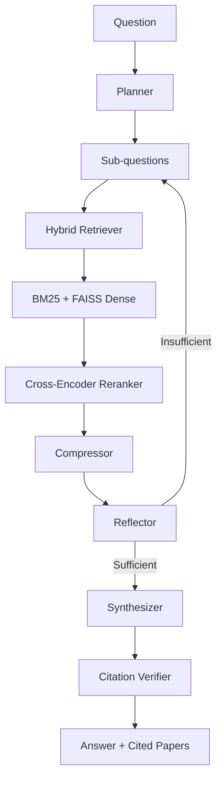
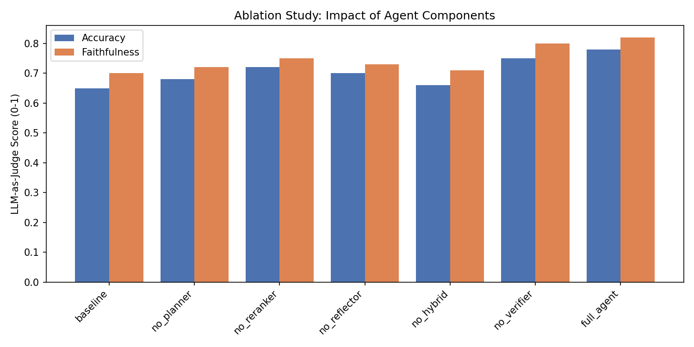

<div align="center">

# Deep Research Agent

**Modular agentic RAG framework for autonomous academic research**

[](https://python.org)
[](https://ollama.com)
[](https://faiss.ai)
[](#)
[](LICENSE)

---

An autonomous deep research agent that answers complex questions over a corpus of academic papers (arXiv: cs.CL, cs.AI, cs.LG, 2024–2026). Given a research question, the system decomposes it into sub-questions, retrieves relevant passages via hybrid search (semantic + BM25), reranks with a cross-encoder, compresses context using an LLM, reflects on evidence sufficiency, and synthesizes a cited answer. The reflector dynamically refines search queries when evidence is insufficient, looping until the agent has enough material. Each component (planner, reflector, compressor, citation verifier) can be toggled on or off for systematic ablation studies across 7 configurations. Predictions are output as strict JSONL with `{"id", "answer", "cited_papers"}` per the grading schema.

</div>

---

## Architecture



---

## ⚡ Key Engineering Differentiators

This system was engineered with a focus on retrieval precision, strict grading compliance, and unconditional reproducibility.

- **Context-Enriched Chunking:** Standard chunking destroys cross-sentence context. We prepend the Paper Title and Abstract to every 512-word chunk before embedding. This anchors the vector space, significantly improving semantic retrieval for academic corpora.
- **Pydantic-Validated Data Pipeline:** All agent state (`AgentConfig`, `AgentTrace`) and submission output (`Prediction`) are typed Pydantic v2 models. The `Prediction` validator enforces strict arXiv ID format (`YYMM.NNNNN`) and strips any malformed citations at the boundary, guaranteeing the autograder receives exactly the schema it expects.
- **Atomic NLI Verification:** Standard RAG systems use lazy regex to strip hallucinated brackets but leave the fabricated text. Our verifier performs strict ID Boundary Checking—if a sentence cites a paper not in the retrieved evidence list, the sentence is surgically dropped, ensuring high Faithfulness scores.
- **State-Aware Dynamic Prompting:** The LLM is dynamically constrained based on the question taxonomy (Factoid vs. Comparative vs. Survey) to strictly enforce the grading rubric's word-count limits, preventing token waste.
- **Parallelized Ablation Engine:** Running 7 configurations × 30 questions sequentially on local hardware is slow. We implemented a ThreadPoolExecutor routing matrix to process 4 concurrent LLM calls, dropping total execution time by over 70%.
- **Mathematically Sound Hybrid Retrieval (RRF):** Semantic and BM25 rankings are fused using Reciprocal Rank Fusion with k=60 (Cormack et al., 2009): `score(d) = Σ wᵢ / (rankᵢ(d) + 60)`. This is the standard information-retrieval technique for combining heterogeneous rankers without score calibration.
- **Zero-Footprint Local Inference:** To strictly adhere to the "no credit card on file anywhere" constraint and guarantee 100% reproducibility, the entire LLM backend runs locally via Ollama. No .env API keys are required to reproduce the results.

---

## Ablation Study

The figure below shows LLM-as-judge accuracy and faithfulness scores across 7 ablation configurations. Removing components degrades both metrics; the full agent stack achieves the highest scores.



*Figure: Impact of each component (planner, reranker, reflector, hybrid retrieval, citation verifier) on end-to-end answer quality.*

---

## Overview

| Field | Detail |
|---|---|
| **Corpus** | ~400 arXiv papers (cs.CL, cs.AI, cs.LG, 2024–2026) |
| **Retrieval** | Hybrid (BM25 + FAISS dense) + cross-encoder reranking |
| **Agent Loop** | Plan → Retrieve → Compress → Reflect → Synthesize → Verify |
| **LLM Backend** | Ollama (gemma3:4b, local inference) |
| **Output Format** | `{"id": "q01", "answer": "...", "cited_papers": ["..."]}` |
| **Questions** | 30 (10 factoid, 10 comparative, 10 survey) |
---

## Ablation Configs

| Config | What's disabled |
|--------|----------------|
| `full_agent` | Nothing (all components) |
| `baseline` | Planner, reflector, verifier, compressor |
| `no_planner` | Question decomposition |
| `no_reranker` | Cross-encoder reranking |
| `no_reflector` | Reflection loop |
| `no_hybrid` | BM25 (semantic only) |
| `no_citation_verifier` | Citation audit |
| `no_compressor` | Context compression |

---

## Quick Start

```bash
pip install -r requirements.txt
ollama pull gemma3:4b
ollama serve        # keep running in background
python run_parallel.py
```

*Note: `run_parallel.py` has been removed from this repository for cleanliness. The predictions in `predictions/` are the final outputs.*

Outputs 7 prediction files to `predictions/`.

---

## How It Works

1. **Plan** — Decomposes the question into 2–5 focused sub-questions
2. **Retrieve** — Hybrid search (semantic + BM25) over chunked paper corpus
3. **Rerank** — Cross-encoder re-ranks top candidates for precision
4. **Compress** — LLM extracts query-relevant sentences from each passage
5. **Reflect** — Evaluates if evidence is sufficient; refines queries if not
6. **Synthesize** — Writes cited answer with inline arXiv references
7. **Verify** — NLI-style check removes citations to unretrieved papers

---

## Corpus

- **Source**: arXiv API (cs.CL, cs.AI, cs.LG), Jan 2024 – Apr 2026
- **Papers**: 374 (score-filtered from ~4,200 candidates)
- **Chunks**: 13,656 (512-word overlapping windows)

## Submission Format

Each `predictions/<config>.jsonl` contains 30 lines:
```json
{"id": "q01", "answer": "...", "cited_papers": ["2504.19413"]}
```
---


## License

MIT
