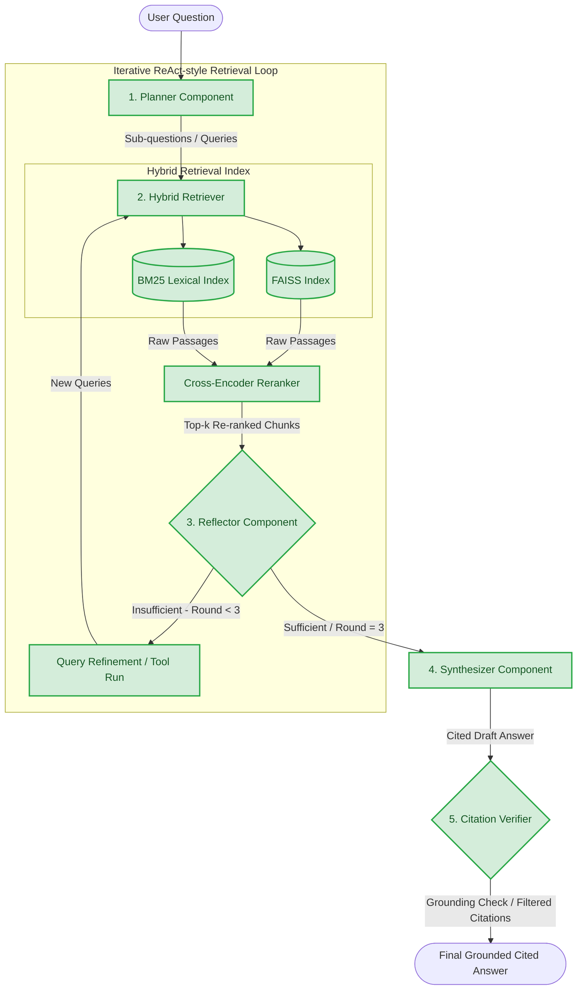

# Agentic Deep Research — Architecture & Project Map

Welcome to **AIMS-DTU Phase 2**! This document provides a highly visual, comprehensive overview of the system's architecture, component status, and execution flow.

---

## 🏗️ System Architecture

This project is an advanced **Agentic Deep Research RAG System** that leverages a **ReAct-style autonomous loop** featuring hybrid multi-index retrieval, multi-query planning, reflection-based self-correction, and citation verification.

Here is the architectural data and decision flow of the deep research system:



---

## 🚦 Phase 2 Deliverables Checklist & Component Status

Below is the exhaustive checklist of all system components. We have categorized them by their operational status:

*   🟢 **Working**: Fully operational, indexes built, and code runs perfectly.
*   🟡 **Needs Fixing**: Operational but requires developer setup (e.g., API key, venv activation) or has performance bottlenecks.
*   🔴 **Needs Work**: Opportunities for enhancement or outstanding Phase 2 tasks.

### 📋 Checklist

| Status | Component / Step | Details |
| :---: | :--- | :--- |
| **🟢 Working** | **arXiv Data Ingestion** | Scraped 374 research papers and successfully downloaded 439 raw PDFs into `data/papers/`. |
| **🟢 Working** | **PDF Parser & Text Chunking** | Extracted and parsed PDFs into 13,656 text chunks stored in `data/chunks/`. |
| **🟢 Working** | **FAISS Indexing** | Built dense vector representations (`sentence-transformers/all-MiniLM-L6-v2`) stored as `faiss_index.bin`. |
| **🟢 Working** | **BM25 Lexical Indexing** | Built sparse keyword indices (`bm25_index.pkl`) to capture exact terminology match. |
| **🟢 Working** | **Cross-Encoder Reranker** | Integrates `cross-encoder/ms-marco-MiniLM-L-6-v2` to filter the initial candidate pools to the top-5 highly relevant passages. |
| **🟢 Working** | **Ablation Study Framework** | Pre-coded to evaluate 7 configurations: `full_agent`, `baseline`, `no_planner`, `no_reranker`, `no_reflector`, `no_hybrid`, `no_citation_verifier`. |
| **🟢 Working** | **Evaluation & Metric Reporting** | LLM-as-judge scoring for *Accuracy* (1-5) and *Faithfulness* (1-5), along with hard set precision/recall for citations. |
| **🟡 Needs Fixing** | **Environment Activation & API Key** | Requires creating local `.env` with a `GEMINI_API_KEY` to link `src/agent/llm_client.py` to the live LLM. |
| **🟡 Needs Fixing** | **Free Tier Rate Limits** | Gemini API calls occasionally trigger 429 rate limit exceptions under dense loads during full ablation runs. |
| **🔴 Needs Work** | **Technical Report Formulation** | Synthesis of the 7 ablation runs into a 4-6 page structured report. |
| **🔴 Needs Work** | **(Optional) Live Web Trace UI** | A web-based interactive interface visualizing the agent's internal plans, retriever, and reflection steps. |

---

## 📖 Complete Architecture Explained in Simple Language

Think of this system as an **elite, highly organized team of academic researchers** working together to write a review paper. Here is how they operate step-by-step:

### 1. The Planner 🧠 (`src/agent/components.py` -> `plan`)
When you ask a complex question like *"How do ReAct and Self-RAG frameworks compare in multi-agent configurations?"*, a single direct search query might miss half the context. The **Planner** breaks down your big question into 2 to 5 targeted sub-questions (e.g., *"What is ReAct?"*, *"What is Self-RAG?"*, *"How are they used together in multi-agent environments?"*).

### 2. The Retriever 🔎 (`src/indexer/retriever.py`)
This is the team's fast archivist. It searches the library of 439 parsed PDFs using two strategies:
*   **Semantic Search (FAISS)**: Finds papers that discuss the same *concepts and meaning*, even if they use different words.
*   **Lexical Search (BM25)**: Finds papers containing the *exact keywords and terms* you searched for.
It then merges these two streams of results (using a formula called *Reciprocal Rank Fusion*) and feeds them to a **Reranker** (a Cross-Encoder model), which ranks them based on which passage is the absolute best match for the query.

### 3. The Reflector 🔄 (`src/agent/components.py` -> `reflect`)
After gathering the top passages, a **Reflector** reads them and evaluates: *"Do we have enough information to write a perfect, complete answer?"*
*   If the answer is **Yes**, it proceeds to synthesis.
*   If the answer is **No**, it identifies what is missing, creates refined search queries, and sends them back to the **Retriever** for another round of searches (up to 3 rounds total).

### 4. The Synthesizer ✍️ (`src/agent/components.py` -> `synthesize`)
Once the facts are gathered, the **Synthesizer** drafts the final response. It is strictly forbidden from making things up (hallucinations). Every single claim it writes must be tied to a specific paper in the repository, cited with its arXiv ID (e.g., `[2210.03629]`).

### 5. The Citation Verifier 🛡️ (`src/agent/components.py` -> `verify_citations`)
Before handing the report to you, a dedicated **Citation Verifier** double-checks the draft. It verifies each bracketed citation against the source text. If a citation cannot be strictly proven by the retrieved text, the verifier strips out the citation bracket while keeping the text, ensuring a 100% grounded and reliable output.

---

### 🚀 Running the Project

To execute individual components, activate your environment and use:

```bash
# 1. Run the interactive research agent to ask questions
python run.py agent

# 2. Run the ablation study across all 7 configurations
python run.py ablation

# 3. Evaluate the generated predictions and print the metrics table
python run.py evaluate
```
